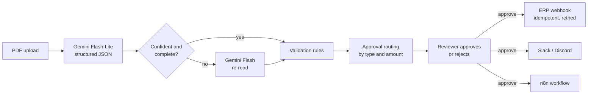

# DocRoute

AI document intake for a construction contractor's back office. Upload a supplier invoice, change order, or submittal as a PDF. DocRoute reads it with Gemini, checks the math and the job number against the ERP, routes it to the right approver, and on approval posts it to the ERP and notifies the team.

**Live demo:** https://YOUR-APP.vercel.app  <!-- replace after deploying -->

 <!-- add after deploying -->

## Why this exists

AP and project-controls staff at a contractor retype hundreds of vendor documents a month into the ERP, check the arithmetic by hand, and chase the right person for approval. Transposed digits and invoices billed to the wrong or closed job slip through. DocRoute automates the retyping and the checking, and keeps a human on the approval.

## How it works



1. **Extract.** The PDF goes straight to Gemini with a JSON response schema, so the model can only answer in the exact structure the app expects. No PDF-parsing library, no parsing of free text.
2. **Escalate only when needed.** `gemini-3.1-flash-lite` reads every document first. If it reports low confidence or misses required fields, `gemini-3.5-flash` re-reads it. Math errors printed on the document do not trigger escalation, because re-reading a wrong invoice doesn't make it right. That's a cost decision, and there's a test for it.
3. **Validate.** Eight rules: required fields, job exists and is open, each line's qty times price, lines sum to subtotal, subtotal plus tax equals total, duplicate vendor and invoice number, due date after invoice date, and model confidence. Any value that fails a check is highlighted in the review screen.
4. **Route.** Submittals go to the Project Engineer. Invoices and change orders go to the Project Manager (under $5k), Operations Manager ($5k–$25k), or CFO (over $25k). Edit `lib/routing.ts` to match a real delegation-of-authority policy.
5. **Decide.** Approving a flagged document requires a note. Rejecting always requires one.
6. **Integrate.** On approval the app posts an ERP-shaped payload with an `Idempotency-Key`, so a retried webhook can't create a duplicate AP entry. It retries network errors and 5xx responses with backoff, logs every attempt on the document, and optionally notifies Slack or Discord and triggers an n8n workflow.

Every model call records input and output tokens (thinking tokens bill as output), cost, latency, and confidence. The **Cost and quality** page rolls these up by model.

## Evaluation

`npm run eval` runs each model on every sample and scores 12 fields against hand-checked answer keys (`lib/samples.ts`), reporting accuracy next to cost.

<!-- Paste the table printed by `npm run eval` here -->
| Model | Field accuracy | Docs fully correct | Cost / doc | p50 latency |
|---|---|---|---|---|
| gemini-3.1-flash-lite | _run eval_ | | | |
| gemini-3.5-flash | _run eval_ | | | |

Four documents is a smoke test, not a benchmark. Next step: 30+ real-world-style documents including scans, photos, and multi-page invoices.

## Run it locally

Requires Node 20.9 or later.

```bash
npm install
cp .env.example .env.local      # add GEMINI_API_KEY
npm run dev                     # http://localhost:3000
npm test                        # 21 offline tests, no API key needed
npm run eval                    # accuracy vs cost, uses your API key
```

Without `GEMINI_API_KEY` the app still runs and shows the four pre-loaded samples. Without `DATABASE_URL` it uses an in-memory store.

## Deploy free on Vercel

1. Push this repo to GitHub.
2. At vercel.com, choose **Add New → Project** and import the repo. Framework: Next.js (auto-detected).
3. Under **Environment Variables** add `GEMINI_API_KEY`. Optionally set `ERP_WEBHOOK_SECRET` to any random string.
4. Deploy.
5. For persistence: in the project, open **Storage → Create Database → Neon** (free tier). It sets `DATABASE_URL`. Redeploy. Tables and sample data are created on first request.
6. Optional: create a Slack or Discord incoming webhook and add it as `NOTIFY_WEBHOOK_URL`.

Budget protection: live extractions are capped per visitor per day (`LIVE_EXTRACTIONS_PER_DAY`, default 5). Also set a budget alert in Google Cloud billing.

Note: the approval step calls the app's own `/api/mock-erp`. If Vercel Deployment Protection is on for preview deployments, test approvals on the production URL.

## n8n

`n8n/approval-workflow.json` is an importable workflow. It receives the `document.approved` event, alerts project controls when the amount is $25k or more, and logs everything else to the AP channel. To run it free, self-host n8n with Docker, import the file, set `NOTIFY_WEBHOOK_URL` in n8n's environment, and expose the webhook with a tunnel. Then put the production webhook URL in DocRoute's `N8N_WEBHOOK_URL`.

## API

| Method | Path | Purpose |
|---|---|---|
| POST | `/api/extract` | Multipart `file` (PDF, 4 MB max) or `sampleId`. Returns the processed document. |
| GET | `/api/documents?status=` | Queue listing |
| GET | `/api/documents/:id` | Full record: extraction, checks, model runs, integration log |
| POST | `/api/documents/:id/decision` | `{ "decision": "approve" \| "reject", "note": "..." }` |
| GET | `/api/documents/:id/pdf` | Original PDF |
| POST | `/api/mock-erp` | ERP stand-in. Requires `X-Webhook-Secret`; idempotent on `Idempotency-Key` |
| GET | `/api/metrics` | Cost, latency, escalation and pass-rate rollups |

## Project layout

```
app/                  Next.js pages and API routes
components/           Upload, decision and nav (client components)
lib/gemini.ts         Gemini REST client: retries, timeout, token and cost capture
lib/schema.ts         Response schema the model must follow
lib/prompt.ts         Extraction instructions (versioned)
lib/pipeline.ts       Cheap-first, escalate-on-doubt orchestration
lib/validate.ts       Business rules
lib/routing.ts        Approval matrix
lib/integrations.ts   ERP webhook, chat notify, n8n, with retries
lib/store.ts          Postgres (Neon) or in-memory storage
lib/samples.ts        Sample answer keys, used for the demo and for eval
scripts/              Offline tests, eval, sample PDF generator
n8n/                  Importable n8n workflow
docs/user-guide.md    One-page guide for AP staff
```

## Limits and next steps

- Scanned and photographed documents aren't in the eval set yet.
- No sign-in; the approver role comes from routing, not from who is logged in.
- The job list is hard-coded; in production it would be read from the ERP.
- Next: per-field confidence, vendor master matching, an MCP server so an AI assistant can query the queue ("what's waiting on the CFO?").

All companies, people, and documents in the samples are fictional.
